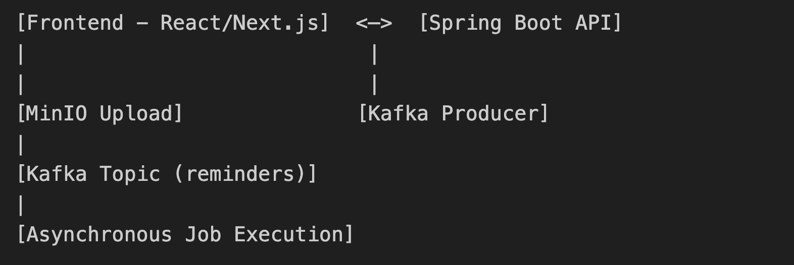
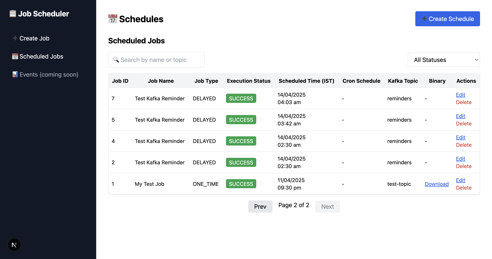
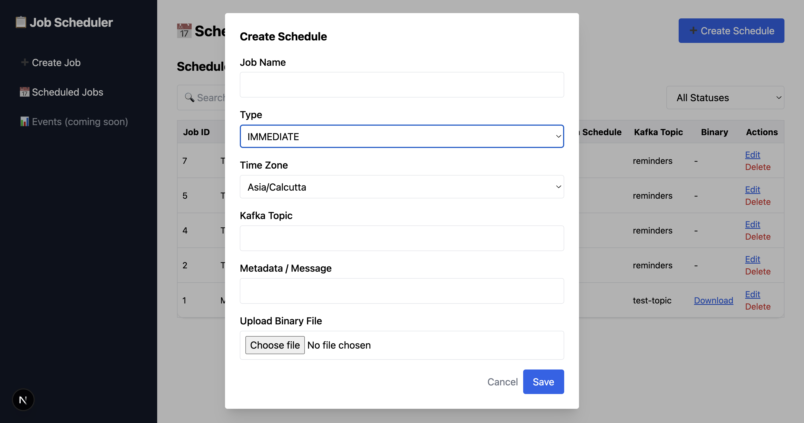

# Job Scheduler Application

This is a full-stack job scheduler application. It supports scheduling various types of jobs (one-time, delayed, recurring, immediate), Kafka message publishing, binary file handling via MinIO, and provides a dashboard UI built with React and Next.js.

## 📚 Table of Contents

- [Features](#features)
- [Tech Stack](#tech-stack)
- [Project Structure](#project-structure)
- [Architecture Overview](#architecture-overview)
- [Getting Started](#getting-started)
- [API Endpoints](#api-endpoints)
- [Testing](#testing)
- [Screenshots](#screenshots)
- [Future Improvements](#future-improvements)

---

## ✅ Features

### 🔧 Backend Features (Spring Boot + Kafka + MinIO)

- Schedule Jobs:
    - Immediate
    - One-time
    - Delayed (with time zone support)
    - Recurring (via Cron expressions)
- Kafka Integration for delayed messaging.
- Binary Upload/Download via MinIO.
- Job metadata storage in PostgreSQL.
- Execution status tracking (`PENDING`, `SUCCESS`, `FAILED`, etc.).
- REST API for CRUD operations.
- Search, Filter, Pagination on Jobs.
- Delete Job with confirmation
- Edit existing job (with updated re-scheduling logic).
- Unit + Integration tests with JUnit, Mockito, Testcontainers.

### 🌐 Frontend Features (React + Next.js + Tailwind)

- Responsive UI with dashboard layout.
- Sidebar for quick navigation.
- Modal to create/edit jobs (with cron/schedule support).
- Table with:
    - Paginated job list
    - Execution status
    - File download link
- Toast notifications for user feedback.
- Friendly error handling and form validations.

---

## ⚙️ Tech Stack

| Layer      | Technology                           |
|------------|--------------------------------------|
| Frontend   | React, Next.js, Tailwind CSS, Axios  |
| Backend    | Java 17, Spring Boot, Kafka, MinIO   |
| Database   | PostgreSQL                           |
| Messaging  | Apache Kafka                         |
| Storage    | MinIO                                |
| Testing    | JUnit 5, Mockito, Testcontainers     |
| DevOps     | Docker, Docker Compose               |

---

## 📁 Project Structure


---

## 🧱 Architecture Overview



---

## 🚀 Getting Started

### 1. Clone the Repository

```bash
git clone https://github.com/pavan-kumar-v-pkv/job-scheduler.git
cd job-scheduler
```

### 2. Run Using Docker Compose (Recommended)

```bash
docker-compose up -d
```

This launches:
* 🐘 PostgreSQL (Database)
* 🐳 Apache Kafka + Zookeeper (Messaging broker)
* 💾 MinIO (Object storage)

- Access MinIO Console: http://localhost:9001
- Login: `minioadmin` / `minioadmin`

### 3. Start Backend

```bash
cd backend/jobscheduler
./mvnw spring-boot:run
```

Alternatively:

```bash
mvn clean install
java -jar target/jobscheduler-0.0.1-SNAPSHOT.jar
```

- Backend will be available at: http://localhost:8080

### 4. Start Frontend

```bash
cd frontend

# (Recommended) Ensure correct Node.js version
nvm install      
nvm use     

npm install
npm run dev
```

- Frontend will be available at: http://localhost:3000

---

## 🔌 API Endpoints

### ➕ Schedule a Job

```http
POST /api/jobs/schedule
```

### 📥 Upload File

```http
POST /api/files/upload
form-data: key=file
```

### 📤 Download File

```http
GET /api/files/download/{filename}
```

### 📃 List All Jobs (with pagination)

```http
GET /api/jobs?page=0&size=10
```

### 🔍 Search/Filter Jobs

```http
GET /api/jobs/search?name=demo&status=PENDING
```

### 📝 Edit Job

```http
PUT /api/jobs/{id}
```

### ❌ Delete Job

```http
DELETE /api/jobs/{id}
```

---

## 🧪 Testing

### Run Unit + Integration Tests

```bash
mvn test
```
Testcontainers is used for:
* PostgreSQL container
* Kafka broker
* Full repository + service layer testing

---

## 🖼️ Screenshots

### Dashboard


### Modal


---

### 🔮 Future Improvements

* ✅ Job retry on failure
* 📈 Job execution analytics

---

### ✍️ Author

👨‍💻 **Pavan Kumar V**
B.E. Computer Science, RV Institute of Technology and Management
[🔗 GitHub Profile](https://github.com/pavan-kumar-v-pkv)